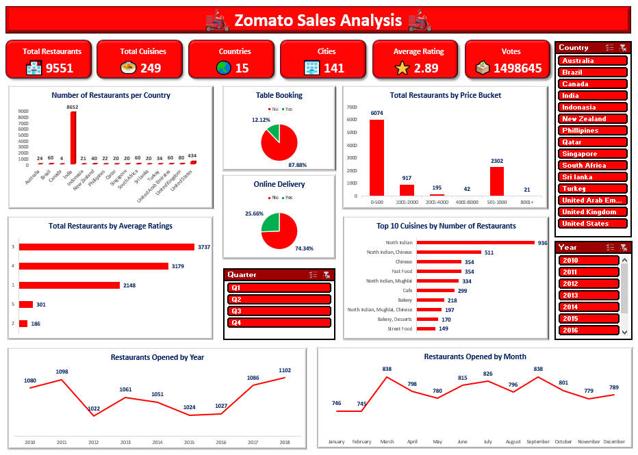
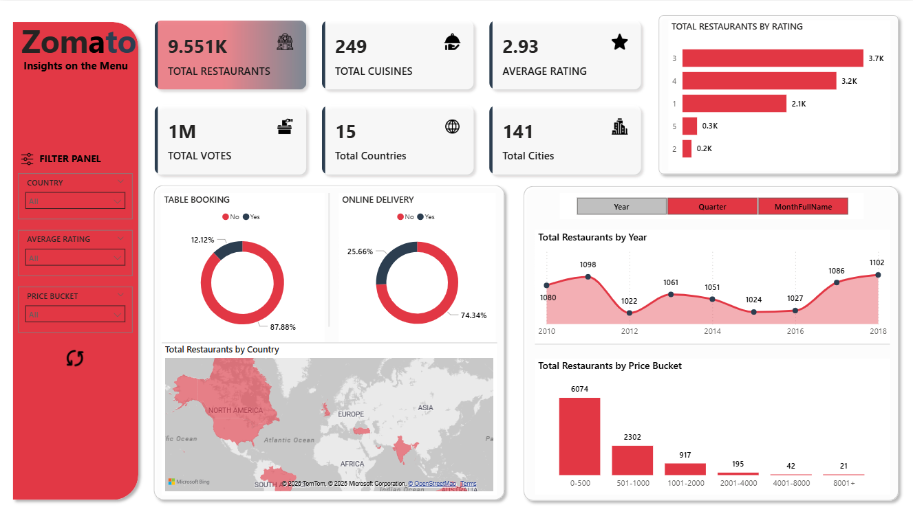

# 🍽️ Zomato Analysis Project
*End-to-End Data Analytics on Zomato Dataset using Excel, Power BI, Tableau & SQL*

---

## 📊 Project Overview
This project is a **comprehensive analysis of Zomato restaurant data**.  
I explored restaurant trends, customer preferences, and performance metrics using **Excel, Power BI, Tableau, and SQL**.

---

## 🗂️ Folder Structure
Zomato-Analysis/
│── README.md
│── Zomato.xlsx
│
├── data/                      
│     └── Raw datasets & supporting files
│
├── reports/                   
│     └── Zomato_Analysis.pbix      # Power BI report
│     └── Zomato_Analysis.xlsx      # Processed Excel file
│     └── zomato_tableau.twbx       # Tableau dashboard (coming soon)
│
├── dashboards/                
│     └── Excel_dash.png
│     └── PowerBi_dash.png
│     └── Tableau_dash.png          # (coming soon)
│
└── sql/                        
      └── queries.sql               # SQL queries & analysis (coming soon)


---

## ⚙️ Tools & Technologies
- **Excel** → Data cleaning, exploration, and dashboard  
- **Power BI** → Interactive reporting & visualization  
- **Tableau** → Advanced data visualization  
- **SQL** → Data querying, filtering, and aggregation  

---

## 🔍 Key Insights
✔️ Popular cuisines across cities  
✔️ Restaurant distribution & density by location  
✔️ Average ratings vs cost analysis  
✔️ Online vs offline dining preferences  
✔️ Visual dashboards for business decision-making  

---

## 📸 Dashboard Previews

### Excel Dashboard  
  

### Power BI Dashboard  
  

### Tableau Dashboard *(coming soon)*  
  

---

## 📂 How to Use
1. Download or clone this repository:  
   ```bash
   git clone https://github.com/your-username/Zomato-Analysis.git
2. Open Zomato.xlsx for the raw dataset.
3. Open reports/Zomato_Analysis.xlsx for Excel-based analysis.
4. Open reports/Zomato_Analysis.pbix in Power BI.
5. Open reports/zomato_tableau.twbx in Tableau (once uploaded).

Run SQL scripts from the sql/ folder on your DBMS to replicate queries.

## 🧑‍💻 Author
**Firdos Shaik**  
📍 Hyderabad, India  
📧 fidduraza9876@gmail.com  
🔗 [LinkedIn](https://www.linkedin.com/in/firdos-shaik-551b4222b/)  

If you find this project helpful, please ⭐ the repo!
